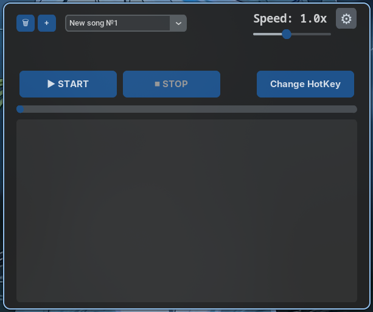

## Multilanguage README
[](assets/readme/README_EN.md)
[](./README.md)
# Virtual-piano-bot
<!-- ![Github Release]
![Github License]
![Github Downloads (all assets, all releases)] -->

A software tool for **automatically** playing music on virtual pianos, including in **`Roblox`**, written with `Python 3.14.7`. Simply paste your sheet notes into the text field, adjust the playback speed, and launch the bot. It supports **single notes**, **chords** (in square brackets), **pauses** and **more**. The bot is controlled via a **custom hotkey**, **save settings** is fully supported

>[!WARNING]
>Antivirus software may flag the release .exe file as malicious - **this is a false positive**. This happens due to the lack of a digital signature, as the project is compiled using **`auto-py-to-exe`**. You can build the executable yourself from the source code if preferred

## Dependencies

### Third Parties Python Packages
```python
keyboard==0.13.5
customtkinter==6.0.0
tkinter # Third parties dependency only on Linux
```

### Built-in Python Modules (Windows & Linux)
```python
threading
time
string
threading
json
```

## Features
+ Automatic music playback
+ Text field for entering notes
+ Hotkey-triggered activation
+ Custom hotkey binding
+ Playback speed configuration
+ Progress bar displaying current track completion

## User Guide for `Windows`
1. Download the executable from the project releases, or build it yourself
2. Launch the .exe file and bind a hotkey first-the program will not function without one
    1. Click the **Change HotKey** button
    2. In the opened menu, click the center button - **Click to Set Hotkey**
    3. Press your preferred key combination
       1. If you want to change it, click **Clear** or click the center button again
    4. Click the green **Save** button to save your hotkey
    5. Click the red **Cancel** button to close the window
 3. Optionally adjust the speed slider located under **Speed: 1x**
 4. Click **Start**
 5.  Press your assigned hotkey to start playback
 6.  Press the hotkey again to pause/stop playback
 7.  Click **Stop** to disable hotkey listening

## User Guide for `Linux`
1. Download the source code
2. Create a `Python` virtual environment
3. Install dependencies from **[requirements.txt](requirements.txt)**
4. Run `main.py` with **root**
5. Bind a hotkey first-the program will not function without one
    1. Click the **Change HotKey** button
    2. In the opened menu, click the center button - **Click to Set Hotkey**
    3. Press your preferred key combination
       1. If you want to change it, click **Clear** or click the center button again
    4. Click the green **Save** button to save your hotkey
    5.  Click the red **Cancel** button to close the window
6.  Optionally adjust the speed slider located under **Speed: 1x**
7.  Click **Start**
8.  Press your assigned hotkey to start playback
9.  Press the hotkey again to pause/stop playback
10. Click **Stop** to disable hotkey listening

## Screenshot

